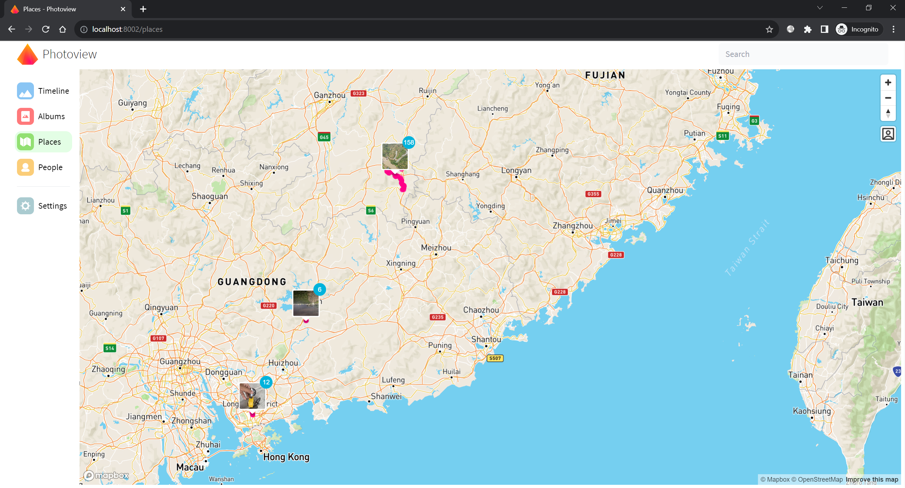

# show_in_file_manager
# Select multiple files in windows explorer and on Mac and Linux.   
### Work with the modified fork of PhotoView (a self-hosted photo and video web gallery).  

**https://github.com/cicadabear/photoview_like_desktop_app**  

  

  

  

Gif https://github.com/cicadabear/show_in_file_manager/blob/main/screen_recoding.gif  

## Notice 
1. The show_in_file_manager.exe file may be intercepted by anti-virus software.   
If you worry about that, you can build it by ```pyinstaller --onefile show_in_file_manager.py```.
2. Due to the different URL length limit in different browsers, if you want to show more than 150 image files, you may need to use Firefox.  
3. Don't forget the ini file.

## Related Links   

https://superuser.com/a/1333892/627078  
https://stackoverflow.com/questions/9355/programmatically-select-multiple-files-in-windows-explorer  
https://github.com/damonlynch/showinfilemanager  
https://github.com/aurire/windows-explorer-files-selector  
https://weblogs.asp.net/morteza/How-to-run-a-desktop-application-from-a-web-page  

