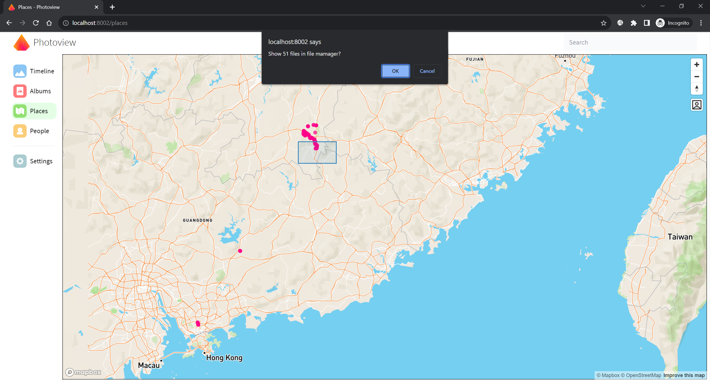
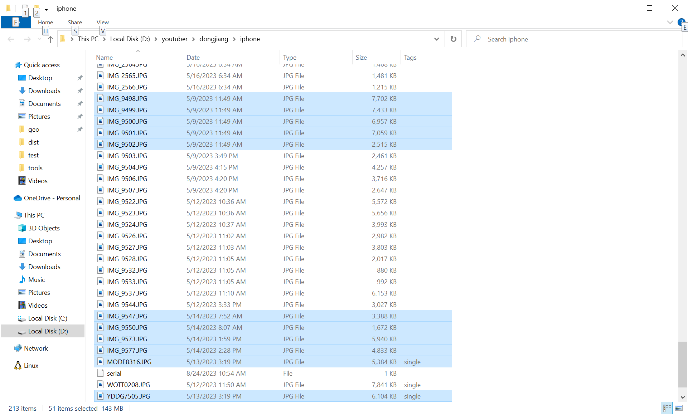

# show_in_file_manager
  

  

Gif https://github.com/cicadabear/show_in_file_manager/blob/main/screen_recoding.gif  

## Notice 
The show_in_file_manager.exe file may be intercepted by anti-virus software.   
If you worry about that, you can build it by ```pyinstaller --onefile show_in_file_manager.py```.  

## Related Links   

https://superuser.com/a/1333892/627078  
https://stackoverflow.com/questions/9355/programmatically-select-multiple-files-in-windows-explorer  
https://github.com/damonlynch/showinfilemanager  
https://github.com/aurire/windows-explorer-files-selector  
https://weblogs.asp.net/morteza/How-to-run-a-desktop-application-from-a-web-page  

